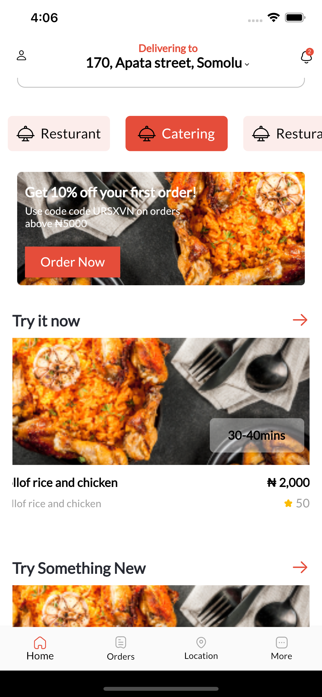
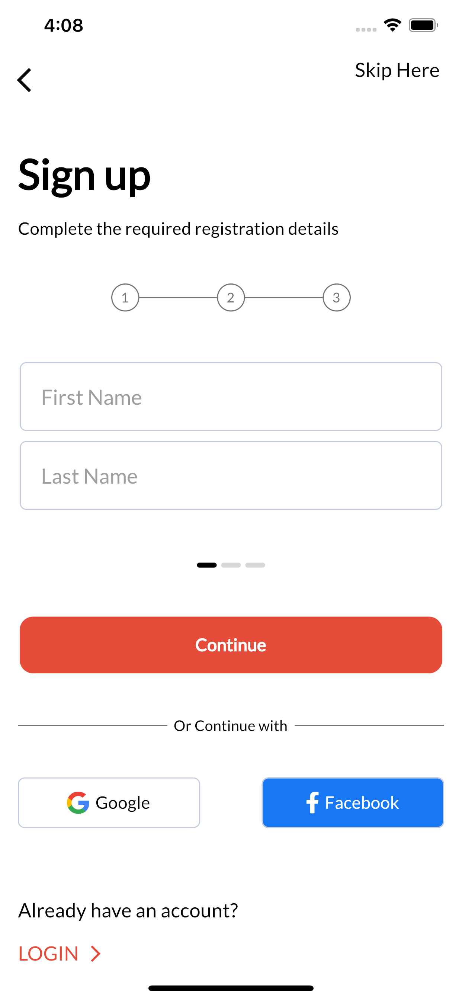
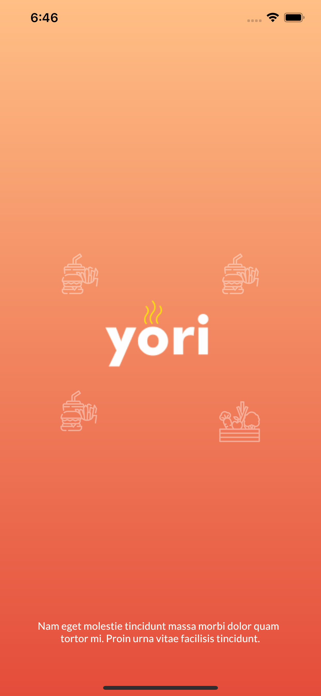
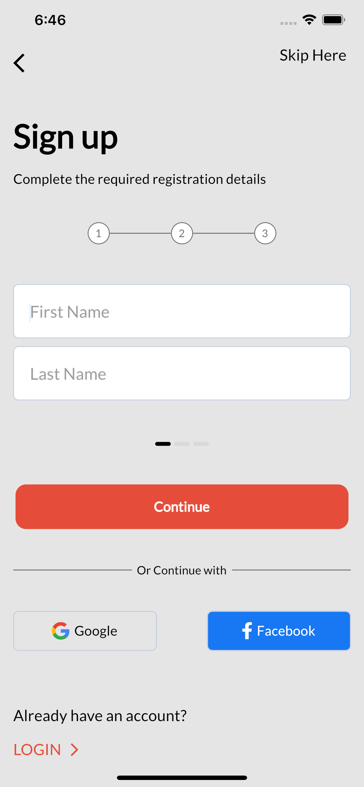
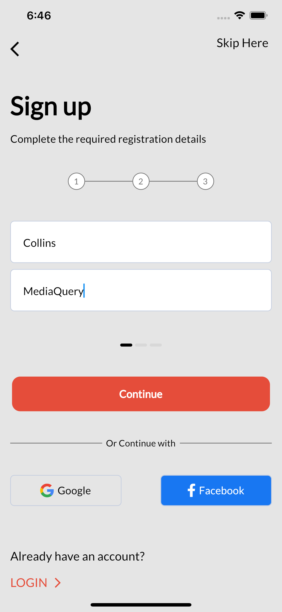
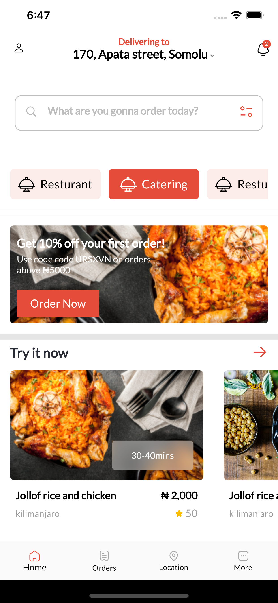
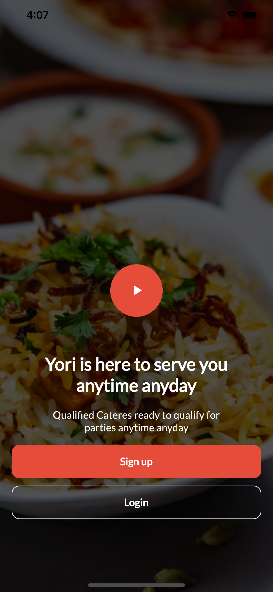
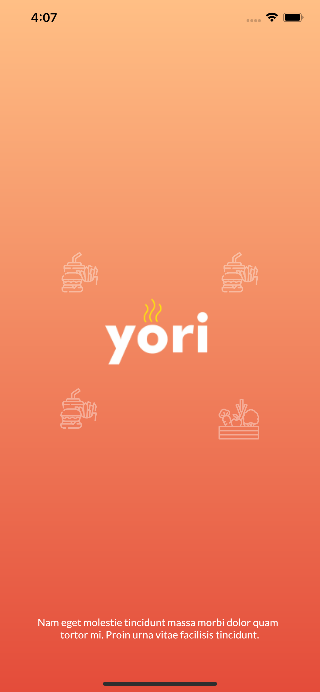

# Food Delivery UI.
A food delivery UI, built with flutter.

## Tools
- figma `design`
- provider `state-management`
- stacked `MVVM achitecture`
- get_it `dependency injection`
- flutter `v2.2.3 - mobile sdk`

